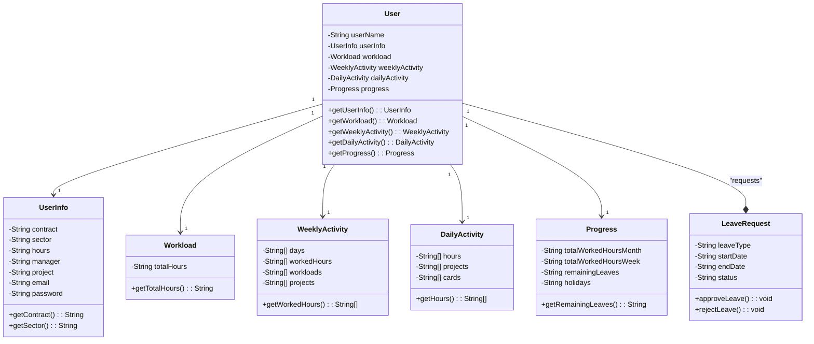

# App de banco de horas - para estudo e desenvolvimento do projeto do decola tech 2025 avanade DIO
Java RESTfulAPI criada para app de banco de horas.

## Diagrama de Classes

```mermaid
classDiagram
    class User {
        -String userName
        -UserInfo userInfo
        -Workload workload
        -WeeklyActivity weeklyActivity
        -DailyActivity dailyActivity
        -Progress progress
        +getUserInfo(): UserInfo
        +getWorkload(): Workload
        +getWeeklyActivity(): WeeklyActivity
        +getDailyActivity(): DailyActivity
        +getProgress(): Progress
    }

    class UserInfo {
        -String contract
        -String sector
        -String hours
        -String manager
        -String project
        -String email
        -String password
        +getContract(): String
        +getSector(): String
    }

    class Workload {
        -String totalHours
        +getTotalHours(): String
    }

    class WeeklyActivity {
        -String[] days
        -String[] workedHours
        -String[] workloads
        -String[] projects
        +getWorkedHours(): String[]
    }

    class DailyActivity {
        -String[] hours
        -String[] projects
        -String[] cards
        +getHours(): String[]
    }

    class Progress {
        -String totalWorkedHoursMonth
        -String totalWorkedHoursWeek
        -String remainingLeaves
        -String holidays
        +getRemainingLeaves(): String
    }

    class LeaveRequest {
        -String leaveType
        -String startDate
        -String endDate
        -String status
        +approveLeave(): void
        +rejectLeave(): void
    }

    %% Relacionamentos
    User "1" --> "1" UserInfo
    User "1" --> "1" Workload
    User "1" --> "1" WeeklyActivity
    User "1" --> "1" DailyActivity
    User "1" --> "1" Progress
    User "1" --* LeaveRequest : "requests"
```
